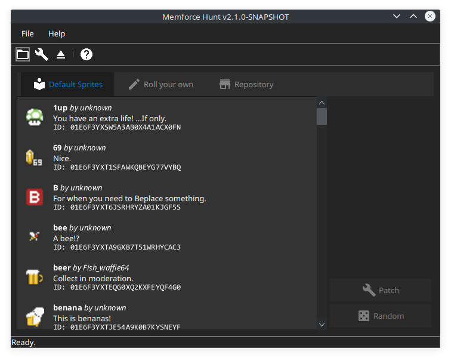
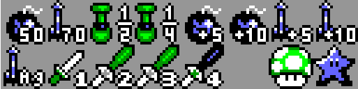

= MemeforceHunt

image:https://img.shields.io/badge/License-Apache%202.0-blue.svg[Apache License v2.0,124,20,link=https://opensource.org/licenses/Apache-2.0]
image:https://www.travis-ci.com/alttpj/MemeforceHunt.svg?branch=master[travis-ci.com,link=https://www.travis-ci.com/alttpj/MemeforceHunt]
image:https://codecov.io/gh/alttpj/MemeforceHunt/branch/master/graph/badge.svg[codecov.io,link=https://codecov.io/gh/alttpj/MemeforceHunt]

This application can be used to alter the imagery in an ALttPR game file for the Triforce Piece item.

_Note: This tool is not permitted for modifying game files that are to be used in a race setting._

== Usage

.Screenshot
[#img-spritemap]

=== Setup

* Get a randomized game file from the http://alttpr.com/[A Link to the Past Randomizer website].
* Open it in MemeforceHunt, select an icon to use to replace the Triforce Pieces, patch it and play!

=== Menu Options

* Open: Open a game file for injection.
* Patch: Execute patching of game file.
* Random: Patch game file with random image for Triforce Pieces.
* Help -> Check for updates: Check to see if there's a new version of the app available.

We have a http://github.com/bmhm/MemeforceHunt/wiki/Icon-Previews[list of images] available for viewing online.

== How it works

This tool will load a specific sprite map which can be seen here:

.Spritemap containing the memforce hunt sprite
[#img-spritemap]

It will replace the second last item in the lower row (the mushroom in the image).

The sprite consists of four tiles, with each tile being a standard item tile (8x8px, 3bpp).
Indexes (starting from 0) are: 44, 45, 60, 61.
